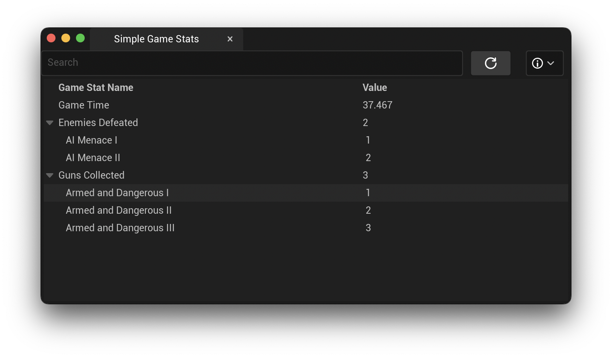

# Debugging Your Game

**SimpleGameStats** comes packaged with an Editor Utility to allow you to view your game's stats while running your game in PIE.



Once game stats are registered via the `SimpleGameStatsSubsystem`, all stats defined in the Data Asset will be present within the Editor UI.

To open the editor, navigate to `Window -> Simple Game Stats`.

## Editor Features

By default, the editor will display a Search Field, a Refresh Button, and a dropdown menu containing a checkmark for Automatic Refresh.


* **Search:** Search by stat name or milestone name.
* **Refresh Button:** Attempts to find game stats and display them in the editor. Game Stats are only available while your game is running in PIE. Otherwise the stat list will be blank.
* **Automatic Refresh:** Enabling **Automatic Refresh** in the editor will set a 1 second timer that automatically calls Refresh. While this should present no performance issues, be sure to disable this when you are not running your game in PIE. You may enable this to check in real time if your game is working as expected.

## Debugging SimpleGameStats

### Logs

If **SimpleGameStats** is not tracking a stat or is not working properly, the first step is to enable the logs in your project. To do this, you will need to open your project's `DefaultEngine.ini` file. At the end of the file, add the following lines:

```ini
[Core.Log]
SimpleGameStats=Verbose
SimpleGameStatsEditor=Verbose
```

Enabling these will display the internal logs for **SimpleGameStats**. These can be used to trace the execution path to see where the problem is occurring.

### Issues & Support

If you diagnose a problem with **SimpleGameStats**, are unable to get it working properly, or have a new feature request, please add an issue to the [Github Issue Tracker](https://github.com/Ericdowney/SimpleGameStatsExample/issues).