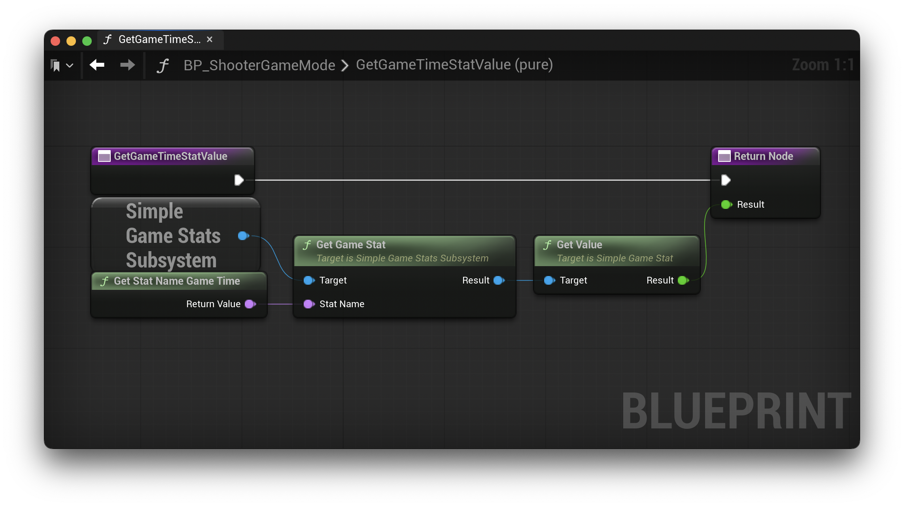
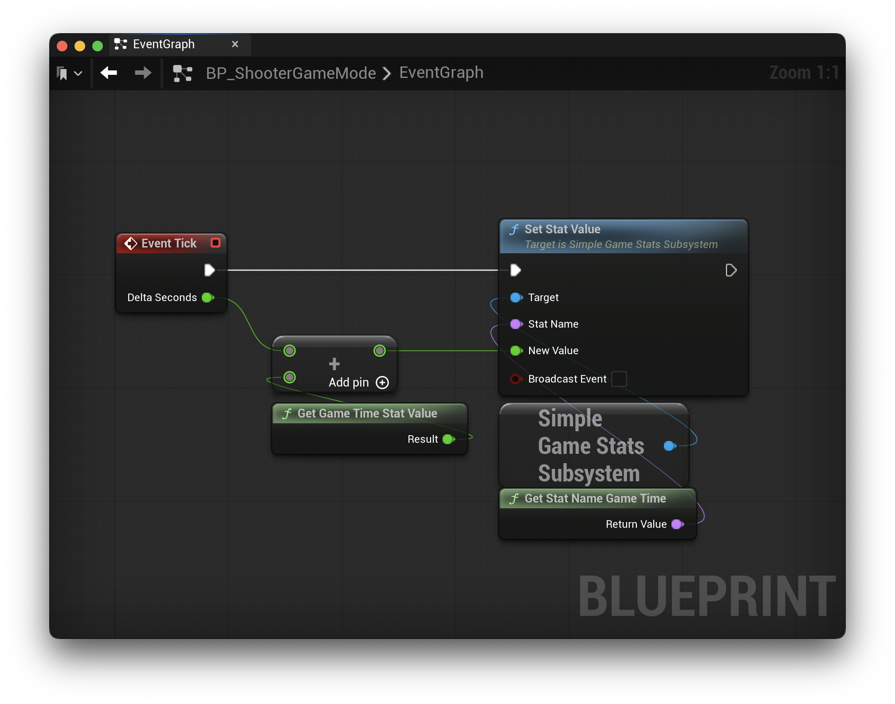

# Example Project - StatPluginExample

The provided example project is the Unreal Engine 5.6 First Person template provided by Epic Games. I've added `SimpleGameStats` to the Shooter template, without removing any existing functionality.

In the example project, I've registered three stats with various milestones:

* Game Time
* Enemies Defeated
    * AI Menace I, Target Value: 1
    * AI Menace II, Target Value: 2
* Guns Collected
    * Armed and Dangerous I, Target Value: 1
    * Armed and Dangerous II, Target Value: 2
    * Armed and Dangerous III, Target Value: 3

In addition, I've added a Blueprint Compatible C++ Constants file. This avoids using "magic strings" throughout the project. Please create an equivalent in your project to avoid problems when renaming or removing stats.

**Note:** The provided example project and below examples use C++. The plugin fully supports both Blueprints and C++. The example is implemented with a mix of both.

## UStatConstants

```c++
UCLASS(BlueprintType)
class STATPLUGINEXAMPLE_API UStatConstants : public UObject
{
    GENERATED_BODY()
    
public:
    UFUNCTION(BlueprintPure, Category="Stat Constants")
    static FName GetStatName_GameTime() { return FName("Game Time"); }
    
    UFUNCTION(BlueprintPure, Category="Stat Constants")
    static FName GetStatName_EnemiesDefeated() { return FName("Enemies Defeated"); }
    
    UFUNCTION(BlueprintPure, Category="Stat Constants")
    static FName GetStatName_GunsCollected() { return FName("Guns Collected"); }
};
```

## AShooterGameMode

In the `BeginPlay` function on the `AShooterGameMode` class, I loaded the stat definitions asset and registered that on the `SimpleGameStatsSubsystem`:

```c++
void AShooterGameMode::BeginPlay()
{
    Super::BeginPlay();

    // ...
    
    USimpleGameStatsDefinition* Definitions = LoadObject<USimpleGameStatsDefinition>(this, TEXT("/Game/Variant_Shooter/Data/DA_StatDefinitions.DA_StatDefinitions"));
    USimpleGameStatsSubsystem* StatsSubsystem = GetGameInstance()->GetSubsystem<USimpleGameStatsSubsystem>();
    if (IsValid(StatsSubsystem)) {
        StatsSubsystem->RegisterGameStats(Definitions);
        StatsSubsystem->OnGameStatMilestoneReachedEvent.AddDynamic(this, &AShooterGameMode::HandleGameStatMilestones);
    }
}
```

## AShooterCharacter

For tracking the "Guns Collected" stat, I'm modifying the `AShooterCharacter` class, the `AddWeaponClass` function. This is the class in the example that is inherited by `BP_ShooterCharacter`, the player character.

```c++
void AShooterCharacter::AddWeaponClass(const TSubclassOf<AShooterWeapon>& WeaponClass)
{
    // do we already own this weapon?
    AShooterWeapon* OwnedWeapon = FindWeaponOfType(WeaponClass);

    if (!OwnedWeapon)
    {
        USimpleGameStatsSubsystem* StatsSubsystem = GetGameInstance()->GetSubsystem<USimpleGameStatsSubsystem>();
        if (IsValid(StatsSubsystem)) {
            StatsSubsystem->IncrementStat(UStatConstants::GetStatName_GunsCollected());
        }
        
        // ...
    }
}
```

Using the `SimpleGameStatsSubsystem`, I call `IncrementStat` for the "Guns Collected" stat every time the player picks up a new kind of weapon.

## AShooterNPC

For tracking the "Enemies Defeated" stat, I'm modifying the `AShooterNPC` class, the `Die` function. This is the class in the example that is inherited by `BP_ShooterNPC`, the AI enemies.

```c++
void AShooterNPC::Die()
{
    // ignore if already dead
    if (bIsDead)
    {
        return;
    }

    // raise the dead flag
    bIsDead = true;

    USimpleGameStatsSubsystem* StatsSubsystem = GetGameInstance()->GetSubsystem<USimpleGameStatsSubsystem>();
    if (IsValid(StatsSubsystem)) {
        StatsSubsystem->IncrementStat(UStatConstants::GetStatName_EnemiesDefeated());
    }

    // ...
}
```

Using the `SimpleGameStatsSubsystem`, I call `IncrementStat` for the "Enemies Defeated" stat every time the AI NPC dies.

## BP_ShooterGameMode

For tracking the "Game Time" stat, I'm modifying the `BP_ShooterGameMode` blueprint, the `Event Tick` event. I've also added a new function to retrieve the current "Game Time" stat value.

*GetGameTimeStatValue:*



*Event Tick:*



In the previous screenshots, `Event Tick` uses the `GetGameTimeStatValue` function and then adds delta time, setting the stat to the new value. The same functionality can be achieved by using the `IncrementStat` function.