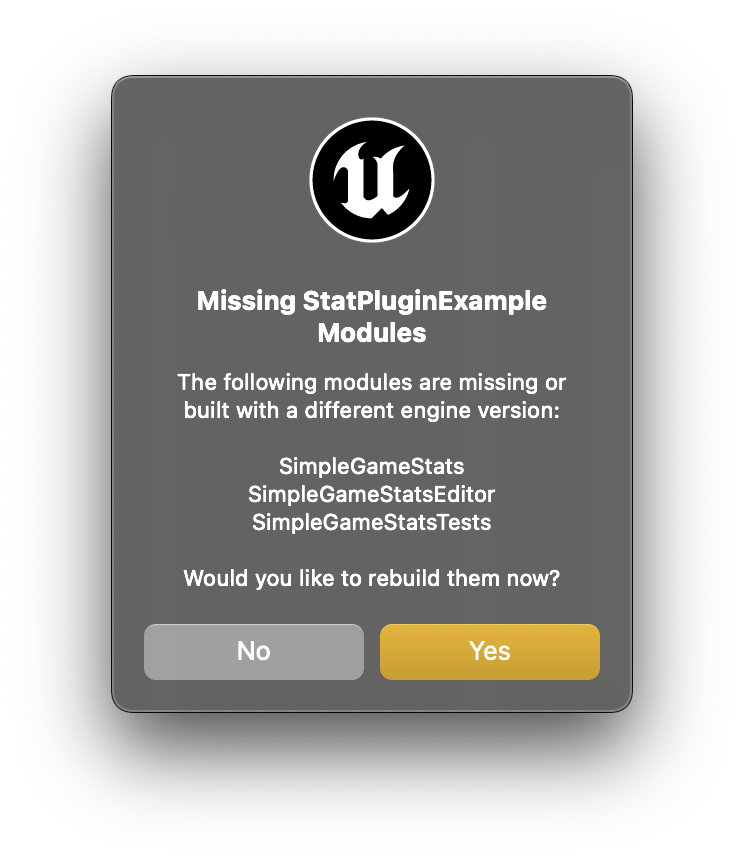
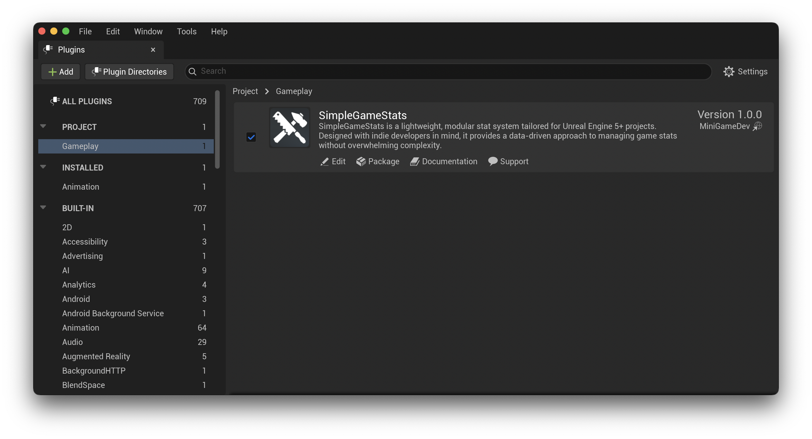

# Installation Guide

* Copy `SimpleGameStats/` into `Plugins/`.
* Open your project in Unreal Engine (You will be prompted to rebuild the project modules).

* Open `Edit -> Plugins` and enable **SimpleGameStats**, if not already enabled.

