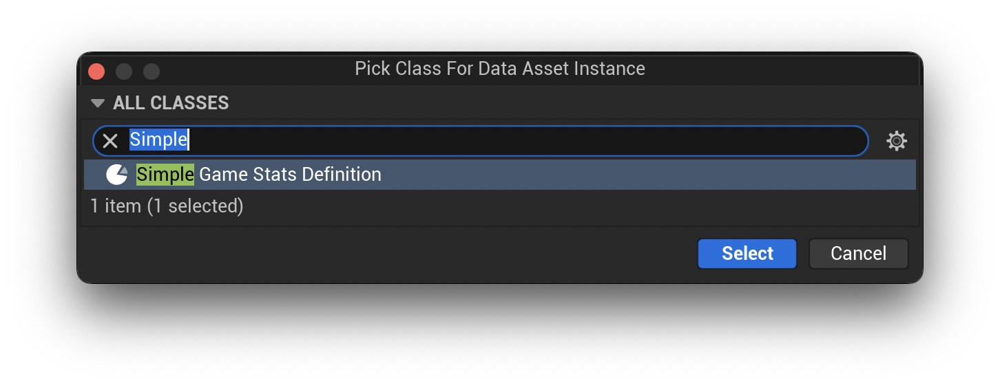
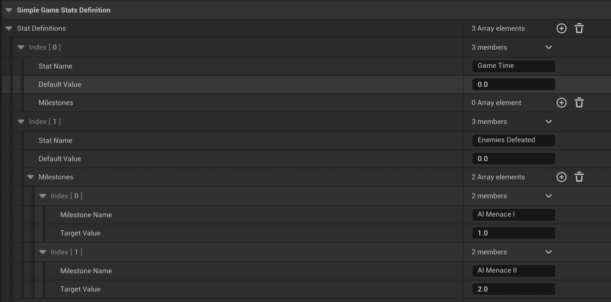
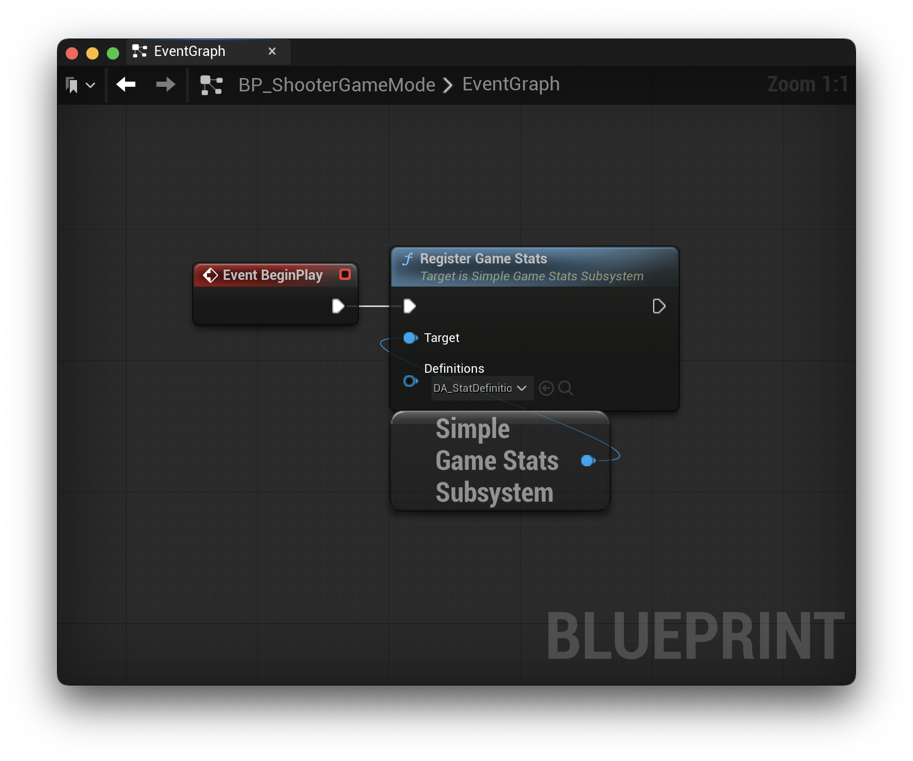
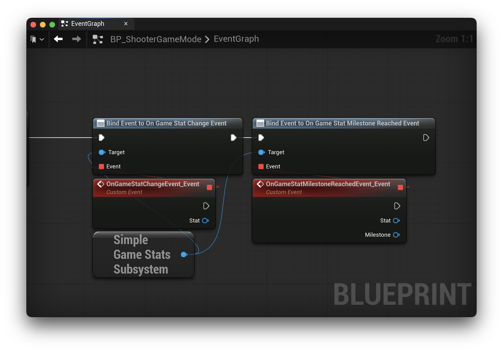

# Setup

Once the plugin is installed and enabled in Unreal Engine, if you want to use the plugin with C++, you will need to add `SimpleGameStats` to your project file, `<YourGame>.uproject`, under `Modules -> AdditionalDepenedencies`. Here's the example's project file for reference:

```
{
    "FileVersion": 3,
    "EngineAssociation": "5.6",
    "Category": "",
    "Description": "",
    "Modules": [
        {
            "Name": "StatPluginExample",
            "Type": "Runtime",
            "LoadingPhase": "Default",
            "AdditionalDependencies": [
                "Engine",
                "AIModule",
                "UMG",
                "CoreUObject",
                "SimpleGameStats"
            ]
        }
    ],
    "Plugins": [
        {
            "Name": "ModelingToolsEditorMode",
            "Enabled": true,
            "TargetAllowList": [
                "Editor"
            ]
        },
        {
            "Name": "StateTree",
            "Enabled": true
        },
        {
            "Name": "GameplayStateTree",
            "Enabled": true
        }
    ]
}
```

## Create Data Asset

The plugin provides a `USimpleGameStatsDefinition` class to create all of your stats. In Unreal Engine, right click in the Content Browser and navigate to `Miscellaneous -> Data Asset`. Select `"Simple Game Stats Definition"` in the dialog.



With the Data Asset created, open it, and define your game's stats. The following is an example of two stats I'm tracking in the example project.



The above image shows the definition of 2 game stats. The first one is "Game Time". I'm using this stat to track how long the player is playing the game. This stat does not define any milestones.

The second stat is "Enemies Defeated". This tracks how many enemies the player defeats in the example project. For this stat, I've defined two milestones.

* **AI Menace I** - Requires 1 enemy killed
* **AI Menace II** - Requires 2 enemy killed

When the value of the stat is greater than or equal to the configured value in the milestone, that milestone will be marked as reached and an event will be published.

## Register Stat Definitions

To register the Simple Game Stats Definition asset, the `SimpleGameStatsSubsystem` has the `RegisterGameStats(USimpleGameStatsDefinition* Definitions)` function. You may use this in either C++ or Blueprints to register the data asset. Once registered, the corresponding stats will be tracked within the subsystem.

**Blueprint**



**C++**

```c++
USimpleGameStatsDefinition* Definitions = LoadObject<USimpleGameStatsDefinition>(this, TEXT("/path/to/asset"));
USimpleGameStatsSubsystem* StatsSubsystem = GetGameInstance()->GetSubsystem<USimpleGameStatsSubsystem>();
if (IsValid(StatsSubsystem)) {
    StatsSubsystem->RegisterGameStats(Definitions);
}
```

Please note that all game stats are identified by name. Names must be unique. In the event you attempt to register a game stat with an existing name, the subsystem will ignore the new stat.

In addition, you may register as many stat definition assets as you like provided the stat names are unique across all assets.

## Bind Events

There are two events that are published by the `SimpleGameStatsSubsystem`.

* `OnGameStatChangeEvent`
* `OnGameStatMilestoneReachedEvent`

**Blueprint**



**C++**

```c++
StatsSubsystem->OnGameStatChangeEvent.AddDynamic(this, &AShooterGameMode::HandleGameStatChange);
StatsSubsystem->OnGameStatMilestoneReachedEvent.AddDynamic(this, &AShooterGameMode::HandleGameStatMilestones);
```

The first event, `OnGameStatChangeEvent`, is published when any registered game stat value changes. This can be used to update UI elements tied to stats or inform different systems of the update.

The second event, `OnGameStatMilestoneReachedEvent`, is published when a registered game stat's milestone target value is reached. This can be used to connect to other achievement or analytics systems.